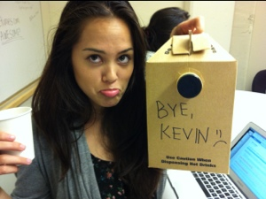

Ten short weeks ago, I walked through this same airport. I was apprehensive of the situation: [A brand new city](http://storify.com/laurenmichell/a-midwesterners-impressions-of-the-pacific-northwe), a new job, not a soul within 20 hours' drive that I personally knew. I put my Midwestern life on hold in pursuit of a strange career.

  

The Seattle Times is an intimidating place to a 20-year-old computer science major. It all seemed so frantic. (Not to mention, I can't say how many times I had to timidly ask for directions to a meeting.)

But there I was, face-to-face with the untouchables who decide what is important enough to land on hundreds of thousands of doorsteps. A college junior, with little more than an eagerness to make an impact.

Needless to say, I survived.

The Seattle Times family could not have been more welcoming, and I will truly miss that. You all allowed my play to become my work, giving me the freedom to direct, the power to enable and the push to create my visions.

Lauren- I really cannot thank you enough for everything you've done to make me feel welcome. You helped me push for what I needed to do my best work, and you stood by me in my errors.

Dean- You were an eager learner, a great questioner and a hidden gem in our organization. I eagerly await the day when your talent is fully realized.

Eric- You were the boss I needed: A person with trust and understanding, and one willing to stick your neck out to defend me. You've been a fantastic mentor throughout, and I'll lean on you for future advice.

Albert- I owe you big time. I don't know how you always figured out a way to get me what I asked for (and maybe I don't want to), but thanks. Without that, I'd just have been a waste of intern payroll.

Cheryl- You showed an eagerness to learn unmatched by most, and that motivated me. You'll be a Pythonista before you know it.

Brian, Bettina, Genevieve, Katrina, Amy, Niko, Bob- You were all so supportive and dedicated time to my obscure requests.

And to everyone, including those I didn't get to know as personally- You've been a wonderful family and have reinforced my desire to work in such an environment. You have all been friends, and that does not end today.

I couldn't be happier with my decision to come to the Seattle Times this summer. My only wish is this: that the progress we have made in the past ten weeks does not fade, but accelerates into something we can all look back on and smile about.

It's a day of mixed emotions, but the high of what we've accomplished overrides. Thanks for having me.

