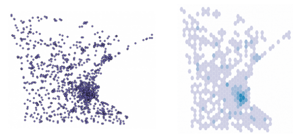

Nothing tickles my fancy more than a good mapping technique, and the recent [L.A. Times's 911 response map](http://graphics.latimes.com/how-fast-is-lafd/) did just that. The novel idea they brought to news mapping: [hexagon binning](http://cran.r-project.org/web/packages/hexbin/vignettes/hexagon_binning.pdf).

**Dot density maps are hard**

A successful dot density map requires a specific data set. The points must be dense enough to be interesting, but not too crowded so as to overlap each other. Maps with multiple zoom levels must perform magic to correctly display points with optimal sparsity. Perceptually, dots indicate data at a specific location, which doesn't bode well for census-block level datasets.

Hexagon binning can alleviate these issues. In hexagon binning, a grid of a hexagons is placed over the extent of the points, and the number of points intersecting each shape is saved with the grid. The grid can then be visualized based on this accumulation, enabling better comparisons between dense areas of a dataset. Since there are no points, there is no overlapping. The locations of the individual points are replaced by a less fine-grain grid, revealing the interesting **–** and many times more pertinent **–** trend data.

Many dot density maps suffer from crowding of points. Binify uses hexagon binning to alleviate this pain and better display trends.

Performing hexagon binning on deadline isn't easy. [Mmqgis](http://michaelminn.com/linux/mmqgis/), a useful [QGIS](http://qgis.org/) plugin, can help with the step of creating the grid, but it requires using a GUI and is finicky. It can't easily be automated. And it certainly can't end up in a Makefile, [as we'd prefer all our data manipulation to](http://bost.ocks.org/mike/make/).

**Introducing: Binify** &mdash; A command-line tool to better visualize crowded dot density maps. (That's bin-i-FY, for you phonetics.)

Binify takes all the meticulous guesswork out of hexagon binning. Simply give the program a point shapefile, and it'll output a calculated hexagon grid version of the data ready to be visualized.

Binify is available in the Python Package Index (PyPI) for simple installation. To get started, [follow the instructions on GitHub](https://github.com/kevinschaul/binify). I built the tool with the simplicity to be used for exploratory analysis, and with enough customization to cover all needs. (Of course, it's work in progress. If you have an idea, please [open an issue on GitHub](https://github.com/kevinschaul/binify/issues).)

While hexagon binning is not the ultimate solution for every dataset, it's a viable option for many. I hope you'll find Binify as useful as I already have.

