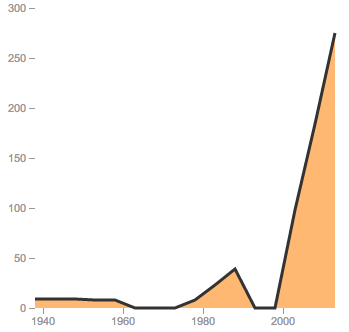
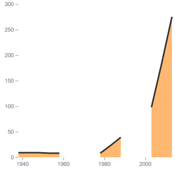
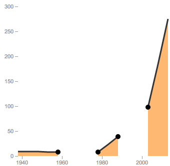
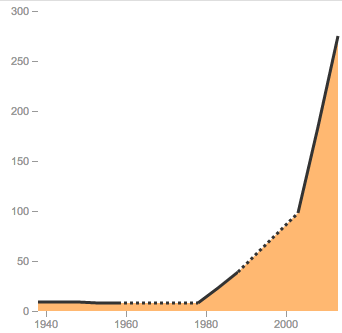

As I began building charts for my first major New York Times interactive feature, [A Nation of Wineries](http://www.nytimes.com/interactive/2013/07/07/business/a-nation-of-wineries.html), I stumbled across a familiar problem: our data had large gaps in it, and the charts had to show this.

The problem is easy to solve for print; simply change the portion of the line where data is undefined to a dashed line. On the interactive web, though, such a solution isn't as easy to implement.

Without taking undefined data into consideration, a naive d3 implementation lies to its viewers:

_Click image to view source_

Obviously, this is unacceptable. A better solution uses d3's handy [line.undefined property](https://github.com/mbostock/d3/wiki/SVG-Shapes#wiki-line_defined) to tell the truth:

_Click image to view source_

Of course, we'd like to interpolate between these undefined values, and show an approximate path between the undefined years. Because of the way svg paths work, this isn't an easy task. We can't simply decide which points are defined, and give them a different class. We'll have to draw multiple paths; one for defined points, and others for the undefined paths. Of course, these undefined paths have undefined values, so we must approximate them from the values we do have.

That's exactly what the function [`findCriticalPoints`](http://bl.ocks.org/kevinschaul/5940459#index.html) does. It loops through all the points on the chart, and decides which points are "critical," i.e. which come just before or after a region of undefined points.

_Click image to view source_

Using them, we can draw a path between undefined regions, and style it differently so our viewers can tell the difference.

_Click image to view source_

Huzzah!

