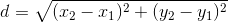
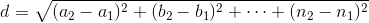

A few months ago, my colleague and fellow beer lover [Chris
Havens](https://twitter.com/chavens) noticed an interesting fact: that
Minnesota was among the nation&rsquo;s leaders in craft brewery growth. Chris
and I knew we had stumbled upon a great opportunity &mdash; we just
didn&rsquo;t know what it was.

Around the same time, [FlowingData](http://flowingdata.com) picked up on a
[great
post](http://blog.revolutionanalytics.com/2013/12/k-means-clustering-86-single-malt-scotch-whiskies.html)
on clustering 86 types of whiskey, which included a fantastic dataset that was
begging to be visualized. I built a [star plot
generator](https://github.com/kevinschaul/d3-star-plot) in d3, which my future
colleague Christopher Ingraham soon expanded into [a beautiful visual
representation of the
whiskey](http://wonkviz.tumblr.com/post/72159021235/whiskey-flavor-profiles).
(Chris [later found the source for the
data](http://wonkviz.tumblr.com/post/72400253092/whiskey-data-sleuthing-with-help-from-reddit)
&mdash; quite the tale.)

I showed Chris Havens, and we immediately saw the underpinnings for the graphic
we finally published: [Beer Me,
Minnesota!](http://apps.startribune.com/news/20140313-beer-me-minnesota/) With
more than 50 breweries currently operating in Minnesota (and no indication of
that trend soon reversing), we hoped to guide readers through the influx of
local craft beer.

### Build-your-own-dataset
Great data visualization requires great data, and no such set existed for
attributes of local craft beer. To ease compilation of the information, Chris
and I built a [Google Form](https://support.google.com/drive/answer/87809) to
send to local brewers. We weren&rsquo;t initially sure what we would be doing
with the data, but many brewers were trusting enough to respond with
information about their favorite brews. We had to be a bit cautious in forming
questions, though, since [the
data](http://apps.startribune.com/news/20140313-beer-me-minnesota/brews.csv)
would be self-reported by the brewers.

### The math behind the matchmaker
Our matchmaker is surprisingly simple mathematically. When the user searches,
the code uses a version of the distance formula to find the closest match.

In a two-dimensional world, the distance between two points is:



It's easy to expand the distance formula to a generic world of `n`
dimensions:



Of course, our beer world had five dimensions: IBUs, SRM, Aroma, ABV, and Body.
Since these attributes had different ranges, we first had to normalize them.
Otherwise, a 10-point difference in IBUs would mask a 0.10 difference in ABV,
though the latter is more substantial.

The mathematics in JavaScript:
```
// Distances will be saved in a two-dimensional array. The first
// dimension will be the source node, and the second will be the
// destination. The value will be the distance between them.
var distances = [];
_.each(normalized, function(src) {
  distances[src.i] = [];
  _.each(normalized, function(dst) {
    distances[src.i][dst.i] = Math.sqrt(
      Math.pow((src.n_abv - dst.n_abv) / 100, 2) +
      Math.pow((src.n_ibu - dst.n_ibu) / 100, 2) +
      Math.pow((src.n_body - dst.n_body) / 100, 2) +
      Math.pow((src.n_aroma - dst.n_aroma) / 100, 2) +
      Math.pow((src.n_srm - dst.n_srm) / 100, 2)
    );
  });
});
```

Visualizing the data was simple with
[`d3.starPlot()`](https://github.com/kevinschaul/d3-star-plot), which I refined
over the course of the project. To introduce readers to this type of chart, we
live-visualized their attribute choices. On slider `change`, I called the
following function:

```
function updateCustomChart() {
  innerChart
    .datum({
      abv: customVal.abv,
      srm: customVal.srm,
      ibu: customVal.ibu,
      body: customVal.body,
      aroma: customVal.aroma
    })
    .call(customStar)

  innerChart.selectAll('.star-path')
    .style('fill', function(d) {
      return srmColor(d.srm);
    });
}
```

It&rsquo;s pretty simple, but to fun (and surprisingly helpful) effect. I leave
building a national version as an exercise for the reader.

[Beer Me,
Minnesota!](http://apps.startribune.com/news/20140313-beer-me-minnesota/)

