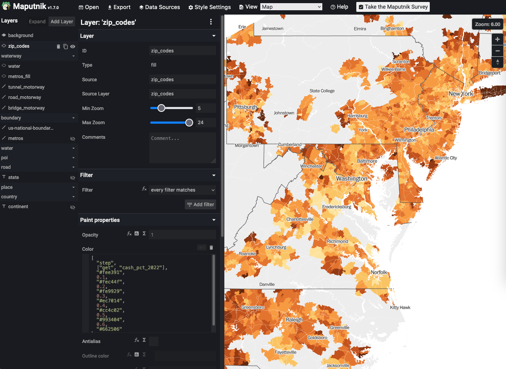
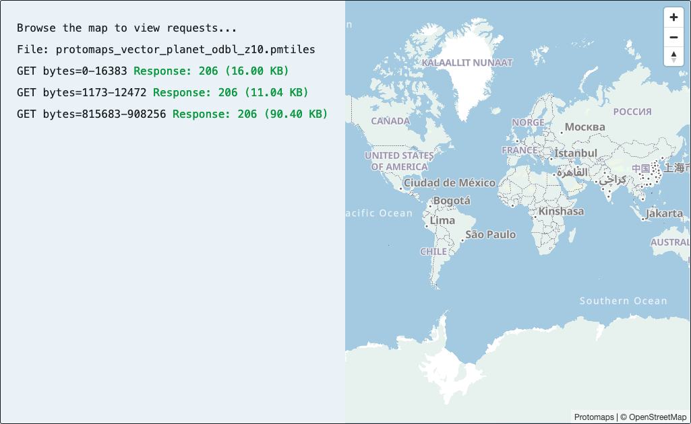
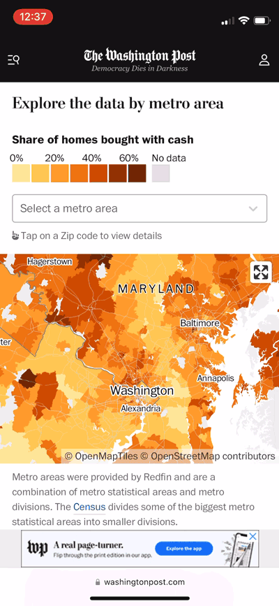

Last week I published [a story](https://www.washingtonpost.com/business/interactive/2023/all-cash-buyers-housing-market/) for The Washington Post that required an interactive slippy map. Lookup maps like this are a common pattern to show a geographic trend and let readers explore the data for their areas.

For about five years, my instinct when working on these stories is to reach for Mapbox, which has continually pushed the field ahead with innovations like [vector tiles](https://github.com/mapbox/vector-tile-spec), a [style specification](https://docs.mapbox.com/mapbox-gl-js/style-spec/) and tools like [tippecanoe](https://github.com/felt/tippecanoe). For some projects, I'm sure we'll continue using Mapbox. But for most of our use cases, we don't need the latest and greatest. And Mapbox has gotten expensive.

Here's what we used instead:

* [OpenMapTiles for building tiles](#openmaptiles)
* [Maputnik for style editing](#maputnik)
* [PMTiles for tile hosting](#pmtiles)
* [Maplibre-gl-js for client-side rendering](#maplibre)

## [OpenMapTiles](https://github.com/openmaptiles/openmaptiles) for building tiles {#openmaptiles}

[OpenStreetMap](https://www.openstreetmap.org/) is an incredible open, community-driven dataset of the world, but it's tricky to work with. The project includes tons of data that is unnecessary for a basemap to put data visualizations over. The [OpenMapTiles project](https://github.com/openmaptiles/openmaptiles) is a set of scripts and tools that download data from OSM and NaturalEarth, load the parts you care about into a database and generate tilesets. It also has the most bonkers [Makefile](https://github.com/openmaptiles/openmaptiles/blob/624cf7a8a30e5c9625da0194eafdcf88d9c104b4/Makefile) I have ever seen.

We used this project to generate a rough U.S. base tileset, and then combined that with other geo data to build a solid — if not barebones — basemap tileset.

## [Maputnik](https://github.com/maputnik/editor) for style editing {#maputnik}



Maputnik is an OSS editor for vector tiles, similar to Mapbox Studio. This tool lets you build out a `style.json` file that contains data sources, layers and style rules.

There's a [CLI](https://github.com/maputnik/desktop) you can install that boots up a local version of the editor. It can even synchronize style edits with a local `style.json` file.

```{bash}
# Install via Homebrew
$ brew install kevinschaul/homebrew-core/maputnik

# Start up the editor at http://localhost:8000/
$ maputnik

# Or, start the editor at http://localhost:8000/ while syncing changes
# to your style.json file
$ maputnik --file style.json
```

## [PMTiles](https://protomaps.com/) for tile hosting {#pmtiles}

PMTiles are an exciting new concept for serving map tiles. Typically tiles are baked out into millions of individual files, organized into directories for zoom level, x and y. A PMTiles file is a single archive containing all of that tile data that's optimized for tile lookups. Client-side maps can use [HTTP Range Requests](https://developer.mozilla.org/en-US/docs/Web/HTTP/Range_requests) to download specific tiles directly from the PMTiles file — no intermediary necessary.



PMTiles are an impressive and elegant solution to tile hosting. Deploying a new tileset to a service like Amazon S3 requires uploading just one big file rather than millions — saving a ton of time. And we don't need to run a tileserver to fetch tiles. It's so smart.

For The Post, I set up an AWS Lambda behind Cloudfront that, given an z/x/y URL, returns a tile from a PMtiles file. The mapping frontend thinks the tiles are regular tiles. I generated PMTiles using [Felt's version of Tippecanoe](https://github.com/felt/tippecanoe), but you can also use the [pmtiles CLI](https://github.com/protomaps/go-pmtiles).

Big thanks [Dylan Moriarty](https://moriartynaps.org/) for sending me a link to PMTiles, and [Brandon Liu](https://twitter.com/bdon) for pushing the tech forward!


## [maplibre-gl-js](https://github.com/maplibre/maplibre-gl-js/) for client-side rendering {#maplibre}

Maplibre is JavaScript library that can render vector tiles. It's a fork of mapbox-gl-js from before they moved to a non-OSS license. It works great.

For this [story](https://www.washingtonpost.com/business/interactive/2023/all-cash-buyers-housing-market/) I implemented a new approach for touch devices: Users can interact with the map either by panning/zooming with two fingers, or by entering fullscreen mode. I think it works pretty well!



All of these projects depend on the open source community to stay relevant. I'm lucky to have gotten to spend work hours contributing back. Hopefully in the near future I can share more about some custom tooling that strings these projects together.
