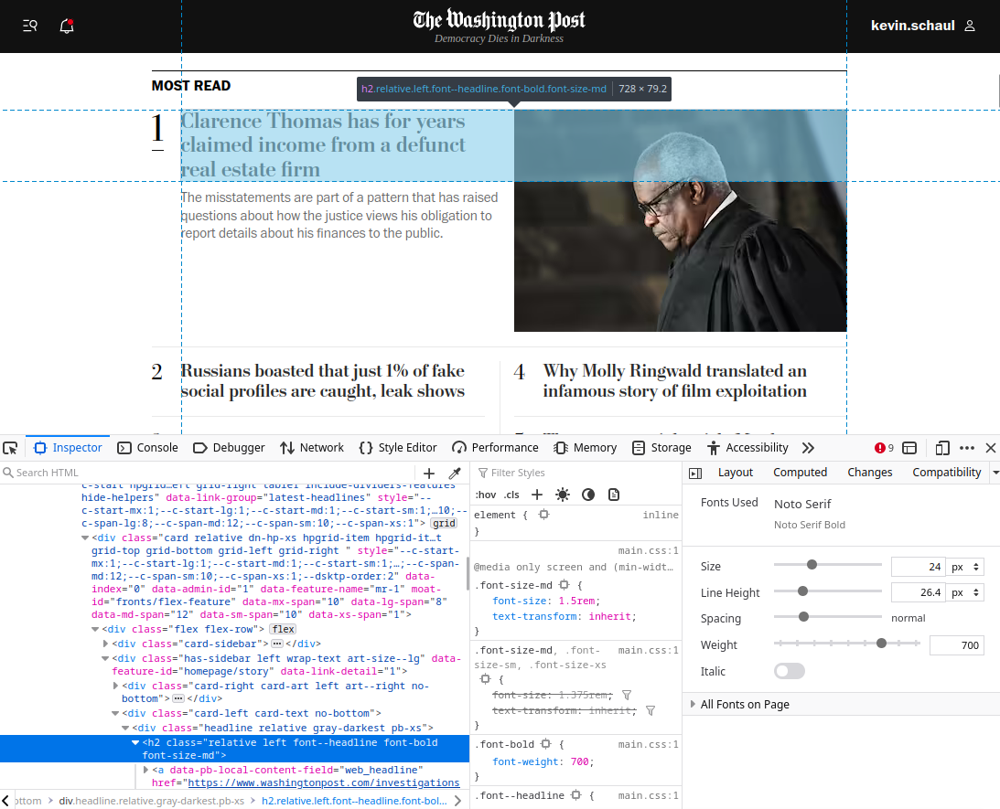
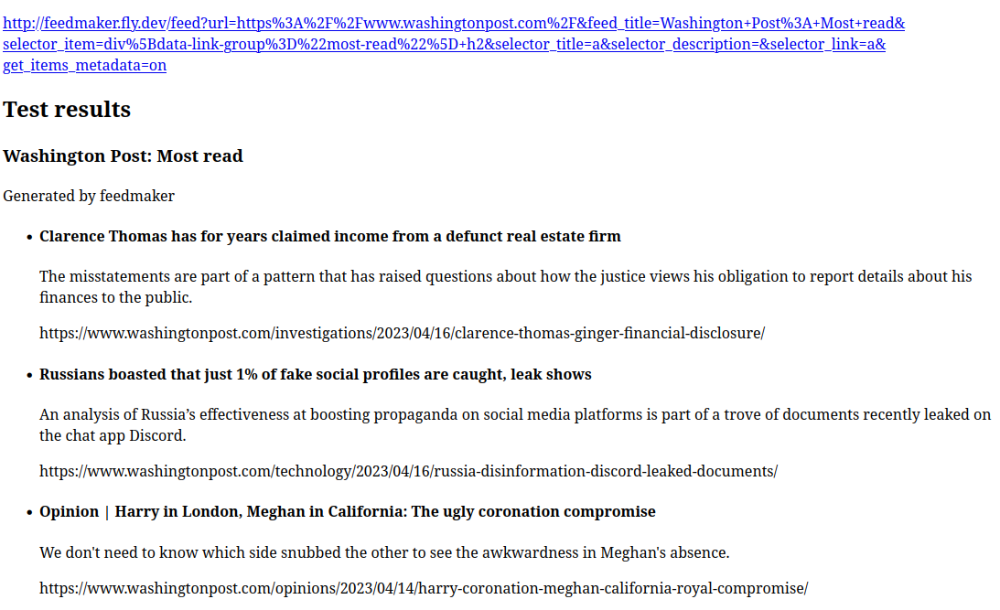

I've been diverting much of my web browsing away from social media and towards RSS feeds, but there are so many sites that don't offer the feeds for the content I care about.

Today I'm sharing a side project called [Feedmaker](https://feedmaker.fly.dev/) ([Source on GitHub](https://github.com/kevinschaul/feedmaker)). It's a service that lets you generate RSS feeds from websites in next to no time. Just figure out a couple CSS selectors and pass them as URL parameters. You'll get an RSS feed back.

For example, say I want a feed of the stories that hit the "Most read" section of the washingtonpost.com homepage. I open up the web inspector and figure out a CSS selector that gets me the items for the feed.

This one works: `div[data-link-group="most-read"] h2`

Then I drop the URL and CSS selector into [Feedmaker](https://feedmaker.fly.dev/) and hit test. The feed looks good! Copy/paste the [feed link](http://feedmaker.fly.dev/feed?url=https%3A%2F%2Fwww.washingtonpost.com%2F&feed_title=Washington+Post%3A+Most+read&selector_item=div%5Bdata-link-group%3D%22most-read%22%5D+h2&selector_title=a&selector_description=&selector_link=a&get_items_metadata=on) into your RSS reader, and enjoy.

The app is quite simple, really. It's just a web scraper that is instructed by URL parameters. Right now, you must pass:

- `url`: URL to scrape
- `selector_item`: CSS selector for the items in your feed

And you can optionally include:

- `feed_title`: What to call your feed
- `selector_title` (default: `a`): CSS selector to get the item's title
- `selector_description`: CSS selector to get the item's description
- `selector_link` (default: `a`): CSS selector to get the item's link
- `get_items_metadata` (default: false): Whether to visit each item's link to gather metadata

In the Washington Post example above, I've asked Feedmaker to get each item's metadata. This is how each item in the feed includes the description -- which only appears on washingtonpost.com for the first item.

Not all feeds that I want include links. One of my favorite record stores lists recommended albums [on their homepage](https://www.reckless.com/). Feedmaker can turn that into [an RSS feed](https://feedmaker.fly.dev/feed/?url=https%3A%2F%2Fwww.reckless.com%2F&feed_title=&selector_item=td.main+.item&selector_title=tr&selector_description=table&selector_link=) too.

(Don't be surprised if Feedmaker goes down. It's hosted on a free hobby fly.io instance.)

I've found this tool quite useful to quickly build RSS feeds for exactly what I'm interested in. Try it out and let me know what you think!
