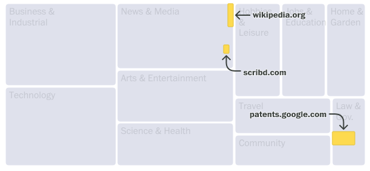
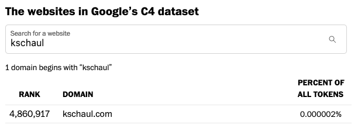

My colleagues and I recently published [this analysis](https://www.washingtonpost.com/technology/interactive/2023/ai-chatbot-learning/) of 15 million websites in a commonly used AI training dataset. Here's a little bit about how we did it.

Allen Institute researchers kindly provided us with the top 1,000 domains in Google’s C4 dataset. But that was just 8% of tokens, hardly representative. So they then pulled all 15.7M domains. We planned to categorize the top 1,000 websites by hand, but all 15.7M wouldn’t work. After talking to some researchers, we used categorization data from analytics firm [Similarweb](https://www.similarweb.com/).

We used [R Markdown](https://rmarkdown.rstudio.com/) for cleaning and analysis, creating updateable web pages we could share with everyone involved. Similarweb's categories were useful, but too niche for us. So we spent a lot of time recategorizing and redefining the groupings. We used the token count for each website — how many words or phrases — to measure it’s importance in the overall training data.

To visualize the data, we immediately jumped to a treemap. The data is parts-of-a-whole (C4 being the whole), and it is hierarchical (categories contain subcategories which contain individual domains).

Annotations were crucial. The treemap works (we hope!) because you see can how individual websites make up the bigger category. We spent a lot of time getting annotations right— tricky for a dynamic chart that rearranges itself at all screen sizes. We hope to open-source some arrow and label-collision-detection code soon.

When we realized our personal websites were in the data, we figured we had to let people search for theirs. There are 15 million domains in the cleaned data. Can we build a search for that data without building an API?

It was easy with this shortcut. Group each domain by the first three letters. Generate a csv for each three-letter combination. When the user types three characters, load that csv and filter it. 10 million domains are distributed across 46,000 files, named predictably like `ksc.csv`.

Parsing the websites in the “clean” training dataset, we found troubling material. We spent days combing through offensive domain names, including racial slurs, obscenities and porn, to confirm their existence and mask specific words from readers in our searchable database.

For a deeper dive into the content of the website themselves. Allen Institute gave us access to their full-text search API, which we used to find the instances of specific terms like “swastika” (72k hits) and “©” (200M hits).

Like all stories, this piece relies on regular reporting. Get curious about a website. Look into it. Ask the experts. Search the data. Eventually you will start to build up an understanding of the data.

[Check out the full story here](https://www.washingtonpost.com/technology/interactive/2023/ai-chatbot-learning/)
