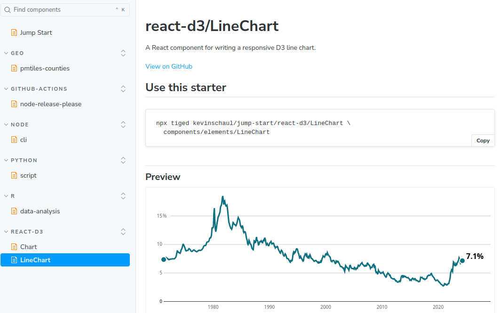
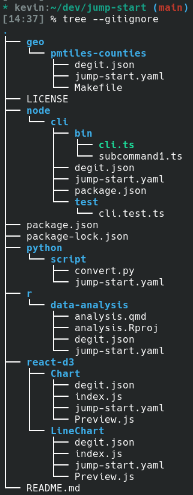

I write a lot of code, for work and for fun. But I often feel myself writing the same code, or setting up a project in the same way, again and again.

This code isn't perfect. It's not worth packaging up and releasing. It's often not even worth putting in some GitHub repository that I'll inevitably forget about. It's just some code that I like having easily accessible. And I think I've finally figured out a way to do that.

I'm calling the system `jump-start`. It's a lightweight system to organize that code that you keep coming back to. It’s a structured GitHub repository and a web frontend. Here's mine [on GitHub](https://github.com/kevinschaul/jump-start), and [on my website](https://www.kschaul.com/jump-start).

## Using a starter



Above is a screenshot of my starter for creating a React component that draws a line chart using d3. I write code like this very often, but it is not something I want to package up. The flexibility of tweaking this chart is crucial. With `jump-start`, now when I need to write some code to draw a line chart, I can locate the command on my website:

```
npx tiged kevinschaul/jump-start/react-d3/LineChart
```

Running this command will drop the contents of my [react-d3/LineChart starter](https://www.kschaul.com/jump-start/?path=/docs/react-d3-linechart--docs) into the current directory. Go ahead, try it!

I've currently got starters for [data analysis in R](https://www.kschaul.com/jump-start/?path=/docs/r-data-analysis--docs), [building a CLI in node](https://www.kschaul.com/jump-start/?path=/docs/node-cli--docs), [building county-level map tiles](https://www.kschaul.com/jump-start/?path=/docs/geo-pmtiles-counties--docs), and a few others. We've got a shared `jump-start` set up at work, as a quick place people can share reusable scripts or React components that aren't quite ready to be moved officially into our template.

## Keep it simple

The beauty of this system, to me, is its simplicity. It's just a git repository with directories of code snippets, each denoted by the `jump-start.yaml` file.



Adding a new starter takes [just a few minutes](https://github.com/kevinschaul/jump-start?tab=readme-ov-file#adding-a-starter). The GitHub readme and the website update automatically, thanks to some logic in [jump-start-tools](https://github.com/kevinschaul/jump-start-tools).

## Set up your own jump-start

I tried to make it easy to start your own `jump-start` instance: Just use [this GitHub template](https://github.com/kevinschaul/jump-start-template). This will set up everything, including the GitHub action that rewrites the readme and deploys the site to GitHub pages. Alternatively you can fork [mine](https://github.com/kevinschaul/jump-start), but be warned -- you might not like the same code I like!

## Possibly future improvements

I like this setup so far, but I wonder if there is room to improve. Some ideas:

- I'm considering building a `jump-start` CLI that hides some of the `tiged` unweildliness. I think it would be really nice to be able to `jump-start LineChart`, or `jump-start work/SharedChart`. It could also keep track of which starters you've used, support autocomplete and other nice features. But that would require a lot of CLI design, and I'm not sure how necessary it is.
- For shared `jump-start` instances, like teamwide ones, it would be great to know which starters are getting the most use, or let people upvote them.
- I wish there were a page that showed screenshots of all of the starter previews. I could see that being really nice for web components.

If you try `jump-start` out, let me know what you think of it? I'm eager to hear.
