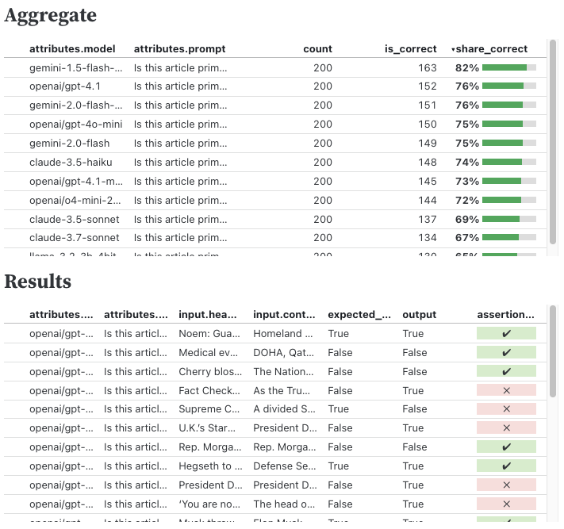
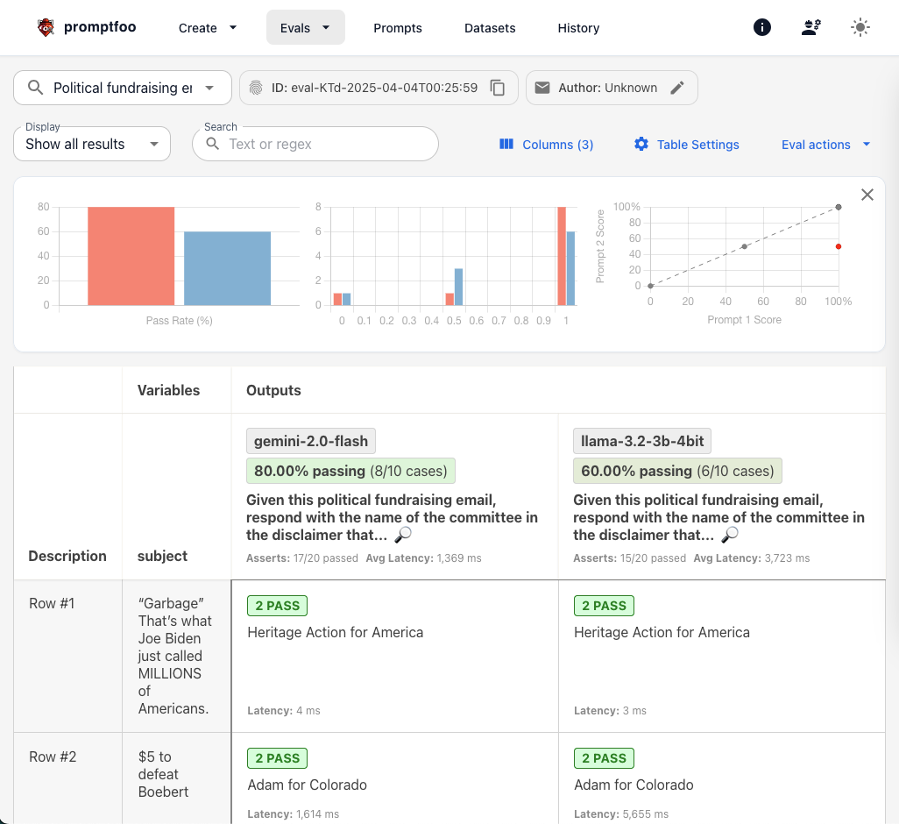

**Update 4/17/25: Added screenshots of my dashboard, and noted switch to pydantic-evals**

Every week some company releases another LLM that blows the previous models out of the water, according to the benchmarks. The charts only go up. The benchmarks are useful on some level. But honestly, they are pretty weird.

If you're doing anything at all interesting with large language models, you need to set up your own evals. Whether you're trying to [extract committee names from political emails](https://thescoop.org/archives/2025/01/27/llm-extraction-challenge-fundraising-emails/index.html), [classify campaign expenditures](https://palewi.re/docs/first-llm-classifier/) or [keep a tracker updated](https://kschaul.com/post/2025/03/05/2025-03-05-use-llm-to-keep-trackers-updated/), I promise that your use cases are much more useful than the benchmarks. Only setting up your own evals will tell you what combination of models and prompts work best for you. After all, you will be directly testing how *you* use them!

Unfortunately setting up evals remains a bit painful. There are lots of ways to test LLMs, but they all feel a bit messy. Trying out a bunch helped me figure out the features I'm looking for.

Here are my [LLM evals](https://kschaul.com/llm-evals/evals/) ([and code](https://github.com/kevinschaul/llm-evals). More coming soon.

And here's what one looks like:

## What I want in an LMM eval framework

- **Write test cases in JSON or CSV** It has to be really, really easy to add test cases. Bonus points if non-programmers can do it too. I don't want to write these in code. [Not to be the xkcd guy](https://xkcd.com/927/), but can we all work out a standard for this?
- **Easily test prompts versus prompts, models versus models, etc.** I want to quickly be able to run different prompts against each other, or different models, or different temperature settings, or all of the above. Ideally without changing more than a little code. Thankfully this part is taken care of by [Simon Willison's excellent llm tool](https://llm.datasette.io/en/stable/).
- **Top-line summaries, explorable details** Show me which prompt/model is best, but let me optionally dig into the details. Let me scroll through the failures to see if there are obvious patterns or easy tweaks I could make.
- **Cache everything** Let me rerun everything without re-pinging all the APIs. But be smart enough to detect changes to stuff like the prompt, any wrapper code, test cases. I'd love to share this across machines -- maybe directly in git?
- **Stability** Don't try to do too much. Just do it well.

## My new favorite: [Pydantic's `evals`](https://ai.pydantic.dev/evals/)

This library is promising. It's faily base-bones right now, but I was able to pretty quickly write some helpers to handle caching, calculating aggregate statistics that I want and output files in a nice format for analysis.

The format I settled on is for each eval to output two dataframes/csvs:

1. An aggregate version that calculates summary statistics across model-prompt variations. This lets you sort by your summary statistic to quickly see the best combination.

| ------------------------------------------------------------------------- |
| attributes.model | attributes.prompt | count | is_correct | share_correct |
| ------------------------------------------------------------------------- |
| gemini-1.5-flas… | Is this article … |   200 |        163 |          0.82 |
| openai/gpt4.1    | Is this article … |   200 |        152 |          0.76 |
| gemini-2.0-flas… | Is this article … |   200 |        151 |          0.76 |

2. A full version that lists out the results for each test-model-prompt combination. This lets you browse specific results to hopefully better understand what's happening.

| --------------------------------------------------------------------------------------------- |
| attributes.model | attributes.prompt | input.headline | expected_output | output | is_correct |
| --------------------------------------------------------------------------------------------- |
| openai/gpt4.1    | Is this article … | Noem: Guantán… | True            | True   | ✔          |
| openai/gpt4.1    | Is this article … | Medical evacu… | False           | False  | ✔          |
| openai/gpt4.1    | Is this article … | Cherry blosso… | False           | False  | ✔          |

Together these outputs give me everything I want to do, so far at least.

I would love to see some of this become either standard in the library or hidden behind another tool (CLI anyone?). But for now this is working great. I'd love to not have to write this code in the future.

## My previous favorite: `promptfoo`

[Here is my setup](https://github.com/kevinschaul/llm-evals/tree/main/political-fundraising-emails) for `promptfoo`. It's basically three steps:

1. I write my test cases to a json file. (Unfortunately due to a bug, I am currently using jsonl.)
2. I include my custom [promptfoo llm_provider](https://github.com/kevinschaul/llm-evals/blob/main/political-fundraising-emails/llm_provider.py) that basically just calls `llm` for whatever model I want to test
3. I wire it all up with [promptfooconfig.yaml](https://github.com/kevinschaul/llm-evals/blob/f4e9169ee8c9f3bd6be2174e56e78c309cd65e1f/political-fundraising-emails/promptfooconfig.yaml#L1). This file specifies the prompts and models I want to evaluate.

With these in place, I can run `promptfoo eval` to run the evals, and then `promptfoo view` to open the results in a browser. They look like this:

I don't know what two of these three charts means, but if you ignore those, the tables are great. Here I can see that gemini-2.0-flash outperformed llama-3.2-3b-4bit on these 10 test cases. I can scroll through and see what cases missed. It's pretty great output, once you know where to look.

It took me a while to figure out how to get `promptfoo` to work, but overall it does nearly everything I'm looking for. I wish it did less -- I find the documentation pretty confusing because it has so many features -- but maybe that's unfair criticism.

## Also interesting: [`pytest-evals`](https://github.com/AlmogBaku/pytest-evals)

This library attempts to treat llm evals somewhat like unit tests, letting you run them with `pytest`. It's an interesting idea that I generally like. It does require you to roll your own analysis functions, though.

I toyed around with building [a similar library](https://github.com/kevinschaul/pytest-llmeval) that simplified usage, including analysis functions and caching for you. But I don't think this is the way forward. I'm more inclined to spend time making `promptfoo` work for me.

## How are you running evals?

If there are other good eval frameworks, please let me know. I don't feel like I've fully cracked the nut yet, though I'm in a much better spot than a few months ago.

