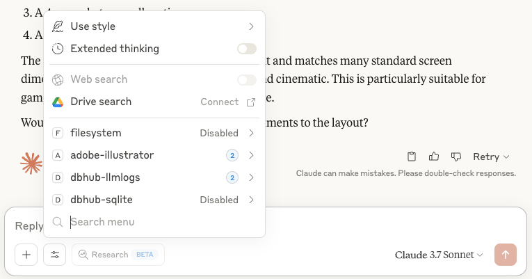

Last week I gave into all the hype about [Model Context Protocol](https://modelcontextprotocol.io/quickstart/user), and I gotta say, my first few experiments blew me away.

The way I understand it, MCP is basically a standard for LLM tool-calling. It lets you hook up code that can do things LLMs can't do, like call APIs to get updated data, or query databases, or even control Adobe Illustrator. MCP lets the LLM know what tools are available, and if the LLM so chooses it can call out to a tool and incorporate the results. The terminology takes some getting used to. Your LLM interface, like Claude Desktop, is the "client" and any tool you want to provide it is a "server."

First I [hooked up Claude to Adobe Illustrator](https://github.com/kevinschaul/illustrator-mcp-server). The tool exposes two abilities: Take a screenshot of the Illustrator window, and execute a script within Illustrator. With just these simple tools, I was able to paste in a message from a copy editor, asking it to find the Illustrator file and make the changes. To my absolute surprise, it just worked:



... almost. It misunderstood that we needed to lowercase the "S" in "soldiers," too. But I can still barely believe that Claude could do that task. With a little more prompt tuning, I bet this can be a useable workflow.

Next I gave Claude access to a local sqlite database of some published articles and asked it a very specific question that required reading through a bunch of them. Claude took a look at the database schema, formulated queries, ran them, modified its query, ran it again, etc. etc., building up a bunch of information that it eventually summarized into a .csv file -- with links to the articles cited for fact-checking.

Listen, I can write a SQL query, but I can't iterate that quickly. And Claude wasn't hiding its strategy from me. I could see every query it did and decide whether it made sense. I could pull out its final queries into a script and run it myself. It just felt like how programming with LLMs should be. I send it off to do its thing, checking that what it's doing makes sense, and fact-checking the results afterward.

So yeah, I'm pretty excited about MCP. You gotta check it out.

The easiest way to get started is via Claude Desktop -- [here are great instructions](https://modelcontextprotocol.io/quickstart/user). You write a json file outlining the MCP servers you have installed. It's a little finicky to set up all the absolute paths, but not too bad once you figure it all out. Here's mine:

```json
{
  "mcpServers": {
    "filesystem": {
      "command": "/Users/kevin/.nvm/versions/node/v20.11.1/bin/node",
      "args": [
        "/Users/kevin/.nvm/versions/node/v20.11.1/lib/node_modules/@modelcontextprotocol/server-filesystem/dist/index.js",
        "/Users/kevin/mcp-files"
      ]
    },
    "adobe-illustrator": {
      "command": "uv",
      "args": [
        "--directory",
        "/Users/kevin/dev/illustrator-mcp-server",
        "run",
        "src/illustrator/server.py"
      ]
    },
    "dbhub": {
      "command": "/Users/kevin/.nvm/versions/node/v20.11.1/bin/node",
      "args": [
        "/Users/kevin/.nvm/versions/node/v20.11.1/lib/node_modules/@bytebase/dbhub/dist/index.js",
        "--transport",
        "stdio",
        "--dsn",
        "sqlite:///Users/kevin/mcp-files/stories.db"
      ]
    }
  }
}
```

Then within Claude Desktop, you'll see tools behind the settings button:



And with that, Claude gets sent descriptions of the tools available and how they work, so it can decide whether any would be useful for a particular query.

There are a bunch more interesting servers available [here](https://modelcontextprotocol.io/examples) and elsewhere.
