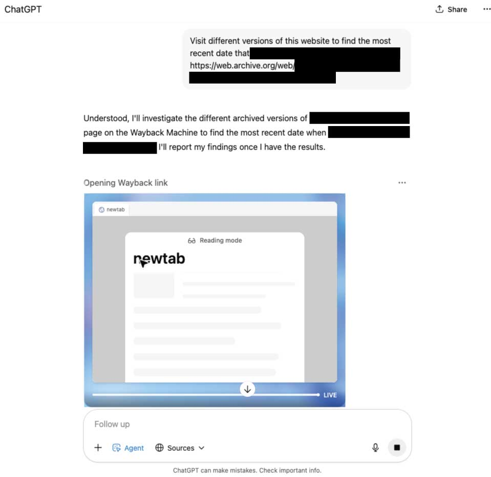
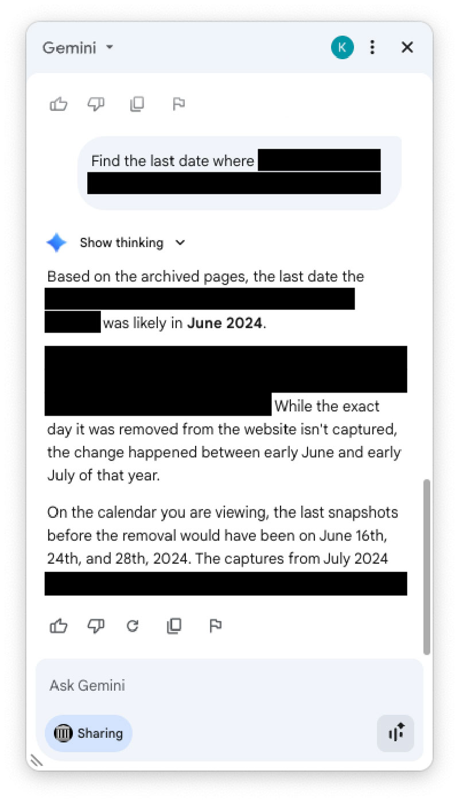

I keep a running log of how AI did on real tasks. This week's notes:

Needed to know when something was removed from a website. I asked ChatGPT “agent mode” to visit the url on wayback machine and figure it out. Five minutes later, it gave me the answer. Save me a ton of tedious clicking, and easily verifiable, too. ✔️

Tried the same task with Gemini for Chrome. Total failure -- made up a bunch of dates. Seemed like it didn’t have access to click through different links? Not sure what went wrong. ✖️

Asked claude code to evaluate whether I should migrate my llm evals site to Eleuther’s eval harness. It churned a bit and suggested “inspect ai” instead since I want to include tool usage evals too. Seems like the right call. ✔️

Made a bunch of Sora 2 videos. Mindblowing, terrifying stuff. [Here's Sam Altman brewing a fresh pot of AI slop.](https://sora.chatgpt.com/p/s_68dff66891e4819197074c52c465a695) Lmk if you need an invite code, I have a few left.

That's it for last week. What are you testing?
